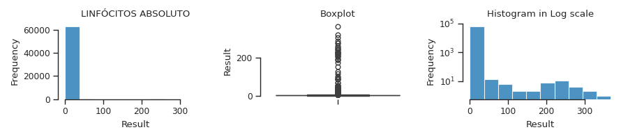
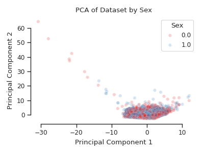
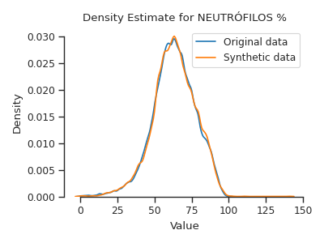
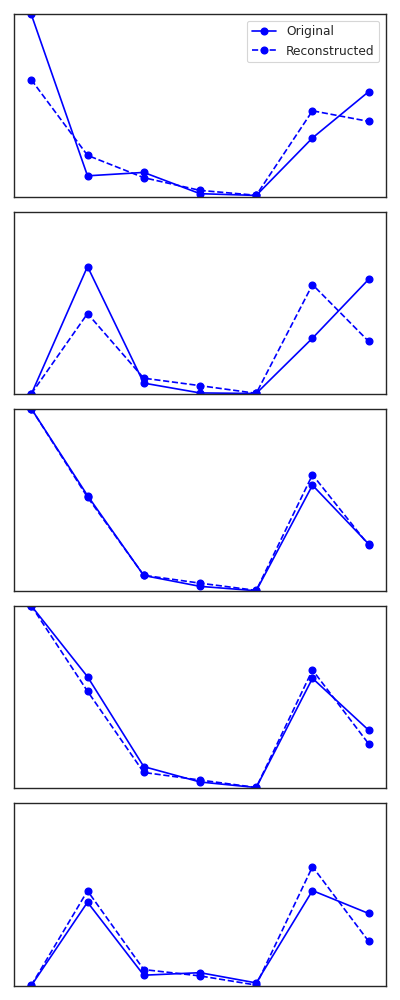
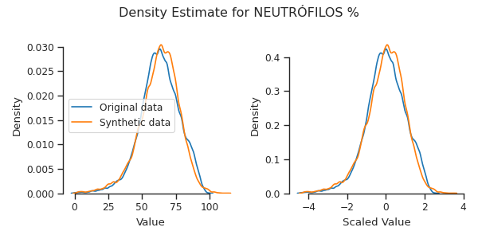

# A1 - Proposta de Modelo de Síntese de Dado Tabular em Saúde

#### IA376N - Redes Generativas Profundas

#### Professora: Paula Dornhofer

#### Aluno: Tiago Amorim (100.675)

Repositório: https://github.com/TiagoCAAmorim/generative_networks/tree/A01/A01_SyntheticData

---

### Tarefa Proposta

Propor e gerar um **banco de dados sintéticos** de resultados de exames de hemograma, a partir de três planilhas extraídas de uma base de resultados de exames de laboratório de análises clínicas. São dados reais obtidos de um hemocentro do estado de São Paulo.

Propor um método, implementar e apresentar uma base de dados sintética com, no mínimo, 1000 resultados de exames fictícios.

Responder à seguinte pergunta: **Como você garante que a sua síntese de dados é realista?**.

### Introdução

A tarefa foi desenvolvida em diferentes _notebooks_ Júpiter, de **A** a **D**. Esta _quebra_ no código foi feita para evitar gerar um único arquivo com um número significativo de linhas de código.

### Parte A: Dados

As três planilhas informadas tem as mesmas colunas, de modo que foi possível concatená-las. Nenhum arquivo tinha os nomes das colunas. Foi possível estimar o tipo de informação de cada coluna a partir dos dados. A transformação dos dados passou por diferentes etapas:

* Amostras inválidas ou  sem representatividade:
    * Retiradas as amostras sem valor associado ao resultado do exame.
    * Retiradas as amostras associadas a exames com poucas amostras.
* Possíveis _outliers_:
    * Histogramas e _box plot_ por tipo de exame indicaram que existem amostras com valores muito maiores que os demais. Cerca de 1 a 2% das amostras tem valores mais afastados que $3\sigma$ da média.
    * Ao mudar o eixo vertical dos histogramas para escala logarítmica foi possível verificar que existe certa _continuidade_ dos dados. Desta forma assumiu-se que os possíveis _outliers_ são amostras válidas, possivelmente associadas a alguma condição médica.

**Figura 1:** Histogramas e _box-plot_ dos resultados de Linfócitos Absoluto.

* Agrupamento dos diferentes exames por indivíduo:
    * Primeiramente foram excluídas as amostras sem identificação de indivíduo. O ID igual a **99999999** aparece com uma frequência muito maior que os demais. Foi assumido que este ID corresponde a _sem identificação_.
    * Foi avaliado o número de diferentes exames que foram realizados por cada indivíduo da base de dados. A maior parte dos indivíduos fez cinco tipos de exame diferente: PLAQUETAS SANGUE, NEUTRÓFILOS ABSOLUTO, LINFÓCITOS ABSOLUTO, NEUTRÓFILOS % e LINFÓCITOS %.
    * Uma base de dados agregados foi montada utilizando os pares **indivíduo-data** que tinham resultados para os cinco exames mais comuns.
    * A base de dados final tem **58.245** amostras (arquivo **data_agg.csv**).

### Parte B: Redução de Dimensionalidade

Antes de partir para implementação de código para gerar amostras sintéticas, foi feito um estudo de redução de dimensionalidade. O objetivo foi avaliar se existem _clusters_ de amostras associados às características das amostras (idade e sexo).

A análise de PCA dos dados dos 5 exames mostrou que ao menos 3 componentes principais seriam necessários para explicar ao menos 90% da variância dos dados dos exames.

Os dois primeiros componentes principais explicam 73,7% da variância, e um gráfico XY das amostras não indicou qualquer separação associada a sexo ou idade. Os dados se apresentaram em sua maioria agrupados em uma região, à exceção de algumas poucas amostras (alguns dos possíveis _outliers_ que não foram descartados).

**Figura 2:** PCA dos exames agrupados, colorido por sexo (0: masculino, 1: feminino).

A análise com o t-SNE também não indicou quaisquer _clusters_ associados a sexo ou idade.

### Parte C: Mistura de Gaussianas

Dados os resultados da análise de redução de dimensionalidade, foi primeiro avaliado o uso de uma abordagem mais simples para a geração de amostras sintéticas: **Mistura de Gaussianas**.

Foi feita uma rápida otimização do número de Gaussianas utilizando BIC como critério. O número _ótimo_ foi de 29 Gaussianas. Gráficos de densidade marginal dos dados reais e dos dados sintéticos mostraram boa coerência.

Os dados de idade e sexo foram agrupados aos resultados dos exames nesta análise, de forma que também são gerados para as amostras sintéticas (arquivo **data_syntheic.csv**).

**Figura 3:** Curvas de densidade dos dados originais e dados sintéticos gerados com GM para Neutrófilos %.

### Parte D: Auto-Encoder Variacional

Foi feita uma segunda tentativa de gerar uma base de dados de amostras sintéticas. Foram aplicadas as ideias do **Auto-Encoder Variacional**. Foi feita uma busca manual por bons hiperparâmetros, e foi observada uma grande dificuldade em equilibrar os pesos e cada função de erro (MSE e KL) para cálculo do gradiente.

O modelo escolhido tem espaço latente de dimensão 5, e conseguiu uma satisfatória reconstrução dos dados de teste. Os resultados das curvas de densidade não foram tão bons quanto o conseguido com a Mistura de Gaussianas. A qualidade dos resultados foi muito dependente da escala em que os dados foram transformados.

**Figura 4:** Exemplos de reconstrução dos dados de entrada (dados escalados entre 0 e 1, sintéticos em tracejado).

**Figura 5:** Curvas de densidade dos dados originais e dados sintéticos gerados com modelo VAE para Neutrófilos %.

### Conclusão

O modelo Mistura de Gaussianas foi capaz de gerar dados sintéticos com distribuições marginais visualmente muito próximas dos dados reais. Análises adicionais poderiam ser feitas para conferir a qualidade dos dados gerados, mas para este conjunto de dados assumiu-se que esta abordagem simples funcionou adequadamente.

Para outros tipos de dados mais complexos a tarefa de avaliação da qualidade dos dados sintéticos pode ser mais difícil de averiguar quantitativamente.